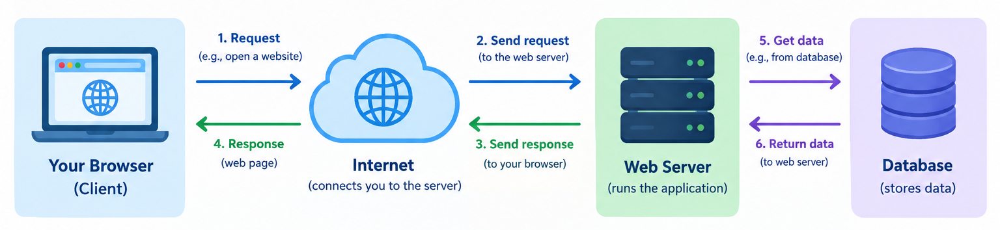

# Week 1: Foundations of Web Application Development

## 1. What Is a Web Application?

A web application is software that runs over HTTP and gets rendered in a
browser or consumed through an API, as opposed to a static website, which
just serves fixed HTML files with no real logic behind them.

The defining trait of a web app is that its logic and state are split
between two places:

- **Client**: the browser or app the user interacts with
- **Server**: the machine that processes requests and holds the data

## 2. The Client-Server Model



The client sends a request. The server processes it and sends back a response. That's the entire loop, repeated millions of times a second across the web.

A few things worth internalizing early:

- The server doesn't "remember" you between requests by default. HTTP is
  stateless. (We'll deal with sessions and cookies in Week 5.)
- The client is responsible for rendering; the server is responsible for
  logic and data. Frameworks like Django help organize the server side of
  that split, which we'll dig into properly in Week 2 (MVC/N-tier).

## 3. HTTP: The Protocol Underneath Everything

HTTP (HyperText Transfer Protocol) is a text-based protocol for
client-server communication. Every request and response follows a
predictable shape.

**A request has:**
- A method (GET, POST, etc.)
- A URL
- Headers (metadata: content type, cookies, auth tokens)
- An optional body

**A response has:**
- A status code
- Headers
- An optional body

### GET vs. POST

| | GET | POST |
|---|---|---|
| Purpose | Retrieve data | Send data to be processed |
| Parameters | In the URL (query string) | In the request body |
| Side effects | None (idempotent) | Usually changes server state |
| Bookmarkable | Yes | No |

You'll use `PUT`, `DELETE`, and `PATCH` too, but those show up properly
starting Week 4 when we build RESTful APIs.

### Common status codes

- `200 OK` — success
- `301 Moved Permanently` — redirect
- `404 Not Found` — the classic
- `500 Internal Server Error` — something broke server-side

## 4. Dev Tools You'll Use All Semester

- **IDE**: VS Code is recommended, but any editor works.
- **Python virtual environments**: isolate each project's dependencies so
  they don't collide with each other or your system Python.
- **Git**:  We'll use GitHub as the repo host for lecture notes.
- **FTP/SFTP**: how files move to a remote server. It matters more once we get to deployment and HTTPS.
- **Web servers**: Apache and Nginx are common in production. Django ships with its own lightweight dev server, which is what we'll use all semester for local development.

## 5. A Quick Survey of Web Application Frameworks

A web application framework (WAF) typically gives you routing, templating, an ORM (Object-Relational Mapping. It's a technique that lets you work with a database using your programming language's objects and methods instead of writing raw SQL), and security middleware, so you're not rebuilding those from scratch on every project.

Some other ecosystems you'll hear about:

- JavaScript / Express
- Java / Spring Boot
- C# / ASP.NET Core

We're using **Python/Django** for the whole course. Keep in mind: Django is the vehicle here, not the destination. The concepts (MVC, REST, ORM, sessions) transfer to any framework you use after this course.

---

## Exercise: Your First Django Project

**Goal:** get a Django project running locally and see the request/response
cycle happen in front of you.

### Setup

```bash
# create and activate a virtual environment
python -m venv venv
source venv/bin/activate   # Windows: venv\Scripts\activate

# install Django
pip install django

# start a project
django-admin startproject mysite
cd mysite

# run the dev server
python manage.py runserver
```

Visit `http://127.0.0.1:8000/` and you should see Django's welcome page.
That page being rendered *is* the request/response cycle we just talked
about: your browser sent a GET request, the dev server processed it, and
sent back an HTML response.

### Project structure

`django-admin startproject mysite` creates two levels:

```
mysite/            <- outer folder, project root (manage.py lives here)
└── mysite/          <- inner folder, the project's config package
    ├── settings.py
    ├── urls.py
    └── ...
```

The inner `mysite` package is meant for project-wide configuration, not
application code. The proper Django way to organize views, templates, and
models is inside a separate **app** (created with `python manage.py
startapp`). We are not doing that today on purpose. Today's goal is HTTP
and GET/POST, not Django's file layout, so we'll put our one view directly
in the config package as a shortcut. In Week 2 (MVC/N-tier) we'll refactor
this exact code into a proper app, once you've seen why that structure
exists.

### Add a view that responds to a GET request

In `mysite/views.py` (new file, next to `settings.py`):

```python
from django.http import HttpResponse

def hello(request):
    return HttpResponse("Hello from the server. Method used: " + request.method)
```

In `mysite/urls.py`:

```python
from django.contrib import admin
from django.urls import path
from . import views

urlpatterns = [
    path("admin/", admin.site.urls),
    path("hello/", views.hello),
]
```

Visit `http://127.0.0.1:8000/hello/`. You should see the method printed as
`GET`. This is the smallest possible example of a server reading a
request and building a response.

### Add a simple form that sends a POST request

Create a `templates` folder at the project root (next to `manage.py`, not
inside `mysite/`), then create `templates/form.html`:

```html
<form method="post">
    
    <input type="text" name="message">
    <button type="submit">Send</button>
</form>
```

The `` tag is not optional. Django rejects POST requests
without a valid CSRF token as a security default, and this is the right
moment to mention it exists, even though we cover web security properly
in Week 8.

Tell Django where to find that folder. In `mysite/settings.py`, find the
`TEMPLATES` list and update the `"DIRS"` line:

```python
import os

TEMPLATES = [
    {
        ...,
        "DIRS": [os.path.join(BASE_DIR, "templates")],
        ...
    },
]
```

Add a view that handles both GET (show the form) and POST (process the
submission), in `mysite/views.py`:

```python
from django.shortcuts import render

def contact(request):
    if request.method == "POST":
        message = request.POST.get("message")
        return HttpResponse(f"You sent: {message}")
    return render(request, "form.html")
```

Add the route in `mysite/urls.py`:

```python
urlpatterns = [
    path("admin/", admin.site.urls),
    path("hello/", views.hello),
    path("contact/", views.contact),
]
```

Visit `http://127.0.0.1:8000/contact/`, load the page, submit the form,
and watch the method and the data change from GET to POST. This is the
core distinction students need to walk away with today.

---

## Bonus Activity (Ungraded, At Home)

Extend the `contact` view:

1. Add a second field to the form, e.g. `name`.
2. On POST, return a response that includes both `name` and `message`.
3. Add basic validation: if either field is empty, re-render the form with
   an error message instead of processing the submission.
4. Optional stretch: use your browser's dev tools (Network tab) to inspect
   the actual request your form sent. Find the request method, the request
   body, and the response status code. Confirm they match what we covered
   in lecture.

This doesn't need to be submitted. It's meant to get your hands on the
request/response cycle one more time before Week 2, where we start
organizing this kind of code properly with MVC, including refactoring
today's `views.py` and `form.html` out of the config package and into a
proper Django app.
