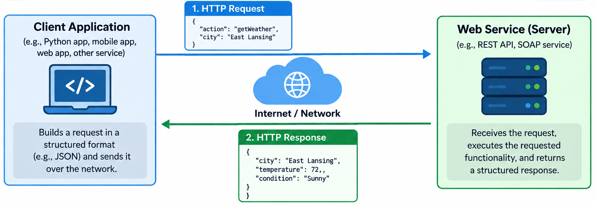
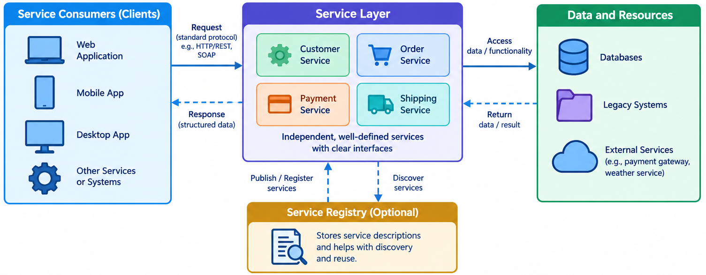
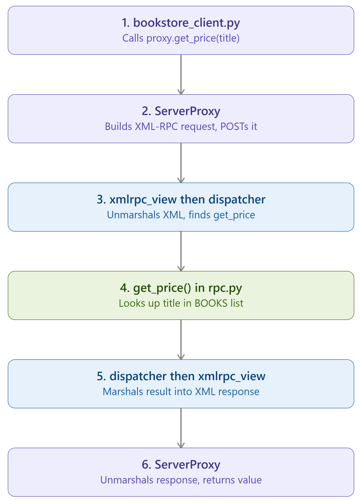

# Week 3: SOA and SOAP Web Services

This week we look at how two separate programs talk to each other. This is one of the most important concepts to learn as you'll often work with systems that would like to share some information with your web apps.

## What is a web service?

A web service is a way for one program to call another program's functionality over a network, using a protocol both sides agree on ahead of time. There's no human clicking links, no HTML rendering. Just structured requests and structured responses.



## Service-Oriented Architecture (SOA)

SOA is an architectural style for building systems out of independent, well-defined services rather than one large connected application. A few principles show up in nearly every definition of SOA:

- Loose coupling: a service shouldn't need to know the internal details of the services it talks to, only the contract.
- Standardized contract: the interface is documented and agreed on before anyone writes code against it.
- Reusability: a service is built once and consumed by many different clients.
- Discoverability: a service can be found and described without reading its source code.
- Statelessness: each call carries what it needs, the service doesn't have to remember the caller between requests.
- Composability: services can be combined to build larger workflows.

None of this is Python or Django specific. It applies whether the service is written in Python, Java, or anything else, which is exactly why it maps to CLO 3 as an architecture topic rather than a language topic.



## SOA roles

Three roles show up in almost every SOA description:

- Service provider: builds the service and publishes its contract.
- Service registry: a directory where providers publish and consumers look up services (historically UDDI, though registries today are often just internal API catalogs).
- Service consumer: finds a service through the registry, then binds to it and invokes it directly.

## XML as a data format

SOAP is built on XML. XML represents data as nested elements with attributes:

```xml
<person id="42">
  <name>Ada Lovelace</name>
  <role>Engineer</role>
</person>
```

Elements can nest arbitrarily deep, attributes hold metadata on an element, and namespaces (the `xmlns` attribute) keep element names from colliding when documents combine vocabularies from different sources. XML was the obvious choice for early web services because it's strict, self-describing, and had strong tool support across every major language by the early 2000s.

## SOAP (Simple Object Access Protocol) Message Structure

A SOAP message is an XML document with a fixed top-level shape:

```xml
<soap:Envelope xmlns:soap="http://schemas.xmlsoap.org/soap/envelope/">
  <soap:Header>
    <!-- optional: auth tokens, routing info -->
  </soap:Header>
  <soap:Body>
    <Add xmlns="http://tempuri.org/">
      <intA>4</intA>
      <intB>5</intB>
    </Add>
  </soap:Body>
</soap:Envelope>
```

Envelope wraps everything. Header is optional and carries metadata that isn't part of the actual call. Body carries the actual request or response data. Fault (not shown above) replaces Body when something goes wrong, and carries a fault code and message instead of a result.

## WSDL: The Service Contract

WSDL (Web Services Description Language) is an XML document that describes a SOAP service so a client can generate code to call it without a human reading source code first. The key parts:

- message: defines the shape of the data being sent or received.
- portType: groups messages into operations (the callable functions).
- binding: says how those operations map onto an actual protocol (SOAP over HTTP, in almost all cases you'll see).
- service: gives the actual network address (endpoint URL) where the binding is reachable.

A trimmed skeleton:

```xml
<definitions name="CalculatorService" targetNamespace="http://tempuri.org/">
  <message name="AddRequest">
    <part name="intA" type="xsd:int"/>
    <part name="intB" type="xsd:int"/>
  </message>
  <message name="AddResponse">
    <part name="AddResult" type="xsd:int"/>
  </message>
  <portType name="CalculatorPortType">
    <operation name="Add">
      <input message="tns:AddRequest"/>
      <output message="tns:AddResponse"/>
    </operation>
  </portType>
  <binding name="CalculatorBinding" type="tns:CalculatorPortType">
    <soap:binding transport="http://schemas.xmlsoap.org/soap/http"/>
  </binding>
  <service name="CalculatorService">
    <port name="CalculatorPort" binding="tns:CalculatorBinding">
      <soap:address location="http://example.com/calculator"/>
    </port>
  </service>
</definitions>
```

You will rarely write WSDL by hand. Tools like `spyne` generate it from your Python code, and clients like `zeep` read it to build a usable proxy object automatically.

## Remote Procedure Calls (RPC)

RPC is the idea of calling a function on a remote machine and having it feel like a local function call, the networking and data serialization happen behind the scenes. SOAP can carry RPC-style calls, and so can much simpler protocols. 

## Exercise 1: Consuming a public SOAP service

Plenty of real systems, banks, shipping carriers, older government platforms, still expose SOAP services, and consuming one is a common integration task. We'll use a long-standing public demo SOAP service so the mechanics are visible without needing an account or API key.

Install the client library first: `pip install zeep`.

`soap_consumer_demo.py`:

```python
from zeep import Client

client = Client("http://www.dneonline.com/calculator.asmx?WSDL")
result = client.service.Add(4, 5)
print(f"4 + 5 = {result}")
```

Walking through what each line actually does:

`Client("http://www.dneonline.com/calculator.asmx?WSDL")` does not just store a URL, it immediately fetches the document at that address and parses it as WSDL. The `?WSDL` at the end is a common convention for services built on older Microsoft ASP.NET tooling: the base address (`calculator.asmx`) is the live service endpoint, and adding that query string to the same address asks the server to return its contract document instead of handling a call. `zeep` reads every `message`, `portType`, and `binding` in that document, the same elements from the WSDL section earlier in these notes, and uses them to build `client.service`, an object with one Python method for every operation the contract declares. Nothing about `Add` is hardcoded into `zeep` itself, it exists purely because the WSDL said it should.

`client.service.Add(4, 5)` looks like an ordinary function call, but `client.service` isn't a real class with a real `Add` method written anywhere. Calling it triggers `zeep` to build a SOAP envelope, Envelope, Body, and an `Add` element carrying `4` and `5` as its parameters, matching the message shape from the WSDL, send it as an HTTP POST to the service's real endpoint, and parse whatever SOAP response comes back into a plain Python value.

You can also see the discoverability principle directly by printing what the client found:

```python
client.wsdl.dump()
```

This prints every operation and message type the WSDL defines, all pulled automatically from the service's own contract, without needing separate documentation.

## Exercise 2: A provider and a client, both under our control

Now we build the other half: a service of our own that something else can call. The scenario is a bookstore that needs to let outside systems, a partner site, a mobile app built by another team, query its catalog. This starts a brand new Django project, `bookstore`.

Project layout after this exercise:

```
bookstore/
├── manage.py
├── bookstore/
│   ├── settings.py
│   └── urls.py
└── catalog/
    ├── __init__.py
    ├── apps.py
    ├── rpc.py
    ├── urls.py
    └── views.py
```

### Step 1: create the project and the app

```
django-admin startproject bookstore
cd bookstore
python manage.py startapp catalog
```

`startapp` gives you the standard app skeleton (`apps.py`, `models.py`, `views.py`, and so on). We'll only touch `views.py` and add two new files, `rpc.py` and `urls.py`.

### Step 2: register the app

In `bookstore/settings.py`, add `catalog` to the installed apps:

```python
INSTALLED_APPS = [
    "django.contrib.admin",
    "django.contrib.auth",
    "django.contrib.contenttypes",
    "django.contrib.sessions",
    "django.contrib.messages",
    "django.contrib.staticfiles",
    "catalog", # feel free to use single quotes
]
```

### Step 3: the book data and the RPC dispatcher

`catalog/rpc.py`:

```python
from xmlrpc.server import SimpleXMLRPCDispatcher

BOOKS = [
    {"title": "Django for Beginners", "author": "William S. Vincent", "price": 39.99, "in_stock": True},
    {"title": "Python Crash Course", "author": "Eric Matthes", "price": 34.99, "in_stock": True},
    {"title": "Fluent Python", "author": "Luciano Ramalho", "price": 54.99, "in_stock": False},
    {"title": "Effective SQL", "author": "John L. Viescas", "price": 44.99, "in_stock": True},
]

dispatcher = SimpleXMLRPCDispatcher(allow_none=True)


def list_books():
    return BOOKS


def get_price(title):
    for book in BOOKS:
        if book["title"] == title:
            return book["price"]
    raise ValueError(f"No book titled {title}")


dispatcher.register_function(list_books, "list_books")
dispatcher.register_function(get_price, "get_price")
```

A closer look at each piece:

`SimpleXMLRPCDispatcher` creates an XML-RPC dispatcher. Think of the dispatcher as the middleman that receives an XML-RPC request, figures out which Python function the client wants, calls that function, and prepares the result as an XML-RPC response. 

`allow_none=True` matters because the original XML-RPC specification has no representation for Python's `None`, there's no `<nil/>` value defined in it. Without this flag, a registered function that ever returns `None` would raise an error trying to serialize it. Neither `list_books` nor `get_price` returns `None` today, but turning this on now means a future addition to the service won't fail on that detail later.

`dispatcher.register_function(list_books, "list_books")` is what actually publishes an operation. The first argument is the real Python function, the second is the name external callers will use to invoke it, they don't have to match, though keeping them the same avoids confusion. Until a function is registered here, the dispatcher has no way to reach it, no matter how it's written elsewhere in the file. This line is doing by hand what WSDL's `portType` and `operation` elements do declaratively for a SOAP service, telling the outside world what's callable.

One more detail worth flagging: if `get_price` raises that `ValueError` for a title that doesn't exist, the dispatcher doesn't let the exception crash the server, it automatically converts any uncaught exception into a generic XML-RPC fault sent back to the caller. It works, but the fault code and message aren't ones we chose. The bonus activity below replaces that with a fault we control on purpose.

### Step 4: the provider view

`catalog/views.py`:

```python
from django.http import HttpResponse
from django.views.decorators.csrf import csrf_exempt

from .rpc import dispatcher


@csrf_exempt
def xmlrpc_view(request):
    if request.method != "POST":
        return HttpResponse("XML-RPC endpoint, POST only", status=405)
    response = dispatcher._marshaled_dispatch(request.body)
    return HttpResponse(response, content_type="text/xml")
```

This is the Django part that receives the HTTP request and passes the XML-RPC message to the dispatcher. `@csrf_exempt` tells Django to skip its normal CSRF protection for this view. Since this endpoint is being called by an external XML-RPC client rather than a normal Django form, we don't have a Django CSRF token.

`dispatcher._marshaled_dispatch(request.body)` does the following tasks:
- Reads the XML-RPC request.
- Determines which function was requested.
- Extracts the arguments.
- Calls the registered Python function.
- Converts the function's result into an XML-RPC response.

Django sends the XML-RPC response back to the client as an HTTP response.

`content_type="text/xml"` matters because a properly behaved XML-RPC client checks the response's content type before trying to parse it. Django's default content type is `text/html`, which is technically incorrect for XML-RPC data, even though most clients tolerate it in practice.

### Step 5: wire up the URLs

`catalog/urls.py`:

```python
from django.urls import path

from . import views

app_name = "catalog"

urlpatterns = [
    path("xmlrpc/", views.xmlrpc_view, name="xmlrpc"),
]
```

`bookstore/urls.py`:

```python
from django.contrib import admin
from django.urls import include, path

urlpatterns = [
    path("admin/", admin.site.urls),
    path("catalog/", include("catalog.urls")),
]
```

### Step 6: run the server, then the client

Start the dev server:

```
python manage.py runserver
```

In a second terminal, write a small client script that plays the part of the outside system querying our catalog. Save this outside the Django project as `bookstore_client.py`:

```python
import xmlrpc.client

proxy = xmlrpc.client.ServerProxy("http://localhost:8000/catalog/xmlrpc/")
print(proxy.list_books())
print(proxy.get_price("Fluent Python"))
```

This is the client-side code. Its job is to make a remote Django function call look like an ordinary Python function call. `ServerProxy` creates a proxy object representing the remote XML-RPC server. Importantly, the actual Python functions such as `list_books()` and `get_price()` are not running in this client. They run on the Django server.

Run the client while the dev server is up. It never touches our database or our Python code directly, it only knows the URL and the method names, exactly like `soap_consumer_demo.py` in Exercise 1 only knew the calculator service's URL and its WSDL. That's the loose coupling and standardized contract principles in practice.

Here is an overall flow of the above exercise:


## Bonus activity (ungraded, at home)

Add a `check_stock(title)` function to `rpc.py` that looks up a book and raises a proper XML-RPC fault if the title doesn't exist, instead of letting the dispatcher raise the generic, uncontrolled fault described in Step 3 above:

```python
import xmlrpc.client

def check_stock(title):
    for book in BOOKS:
        if book["title"] == title:
            return book["in_stock"]
    raise xmlrpc.client.Fault(1, f"No book titled {title}")
```

Register it in `rpc.py` the same way as `list_books` and `get_price`. Then, in `bookstore_client.py`, call `proxy.check_stock("Not A Real Book")` inside a `try`/`except xmlrpc.client.Fault as e` block and print `e.faultString`. This previews the SOAP Fault element from the message structure section above, and gives a first look at handling remote errors instead of assuming every call succeeds.

## References

- [The Principles of Service-Orientation: Introduction to Service-Orientation](https://www.bpminstitute.org/resources/articles/principles-service-orientation-introduction-service-orientation/?srsltid=AU7gw4UaiTCQWQNFiVeULMxLeizKKtutIRmYWzXHJftDJeeZXsEBJHAz)
- [Web Services Description Language (WSDL) Version 2.0 Part 0: Primer](https://www.w3.org/TR/2007/REC-wsdl20-primer-20070626/)
