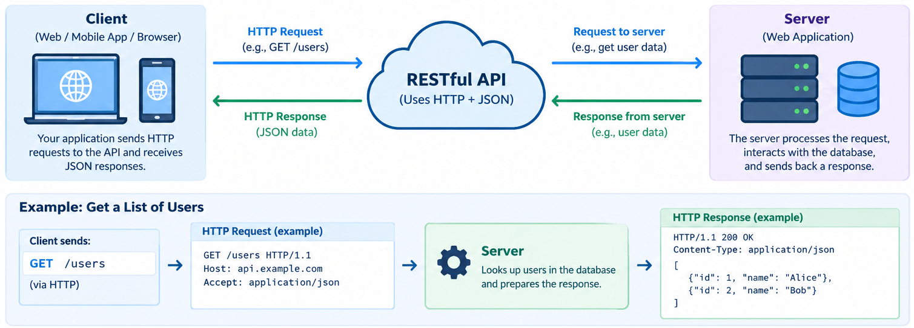

# Week 4: REST, RESTful APIs and JSON

## What REST Actually Is

REST stands for Representational State Transfer. REST is an architectural style, not a protocol. There is no REST envelope, no required library, and no mandatory WSDL equivalent. An API counts as "RESTful" to the degree that it follows a set of constraints.

Three terms come up constantly:

- A resource is anything worth naming: one book, the list of all books, a customer's order.
- A representation is what you receive when you ask for a resource. This week that means JSON. The same resource could also be represented as XML or HTML.
- State transfer means the client moves through the application by requesting and acting on those representations.

### The Constraints

- **Client-server.** The UI and the data storage can evolve independently.
- **Stateless.** Each request carries everything the server needs to understand it, and the server does not remember earlier requests from that client. 
- **Cacheable.** Responses declare whether they can be reused. Browsers and proxies can then skip repeat trips for the same GET.
- **Uniform interface.** Every resource is handled the same way. A URI identifies it, standard HTTP methods operate on it, and messages describe themselves (for example, `Content-Type` tells you how to read the body). 
- **Layered system.** The client can't tell whether it is talking to the real server or to a load balancer, cache, or gateway in between. This is the N-tier idea applied across the network.
- **Code on demand (optional).** The server may send executable code, such as JavaScript. This is the only optional constraint.

### How RESTful Is RESTful Enough?

| Level | What it looks like |
|---|---|
| 0 | One URL, POST for everything. This is exactly our Week 3 XML-RPC service. |
| 1 | Separate URLs for separate resources. |
| 2 | Resources plus proper HTTP methods and status codes. Most production APIs live here, and so will ours. |
| 3 | Responses include links telling the client what it can do next. |

## RESTful API



## Resources and URIs

URIs should be nouns, and the HTTP method should be the verb. Compare how the two styles name the same operations:

| RPC style (Week 3 thinking) | REST style |
|---|---|
| POST `/rpc/` calling `get_price(1)` | GET `/api/books/1/` |
| POST `/getAllBooks` | GET `/api/books/` |
| POST `/createBook` | POST `/api/books/` |
| POST `/deleteBook?id=1` | DELETE `/api/books/1/` |

Common conventions:

- Use plural collection names.
- Put IDs in the path and filters or sorting in the query string, as in `/api/books/?author=Mele&ordering=price`.
- Use nesting to show ownership, as in `/api/authors/7/books/`.
- Keep URIs lowercase and separate words with hyphens.
- Mark the API version in the path (`/api/v2/`) or in a header, so you can change the contract later without breaking existing clients.

## HTTP Methods as the Uniform Interface

| Method | Typical use | Safe | Idempotent |
|---|---|---|---|
| GET | Read a resource or collection | Yes | Yes |
| POST | Create a new item in a collection | No | No |
| PUT | Replace a resource entirely | No | Yes |
| PATCH | Update part of a resource | No | Not guaranteed |
| DELETE | Remove a resource | No | Yes |

A safe method doesn't change anything on the server. An idempotent method has the same effect whether you send it once or five times.

Your data structures background helps here. Setting `table[key] = value` in a hash table is idempotent: run it twice and the table looks the same. Appending to a list is not, because two appends leave two items.

This matters because networks fail. If a PUT times out, the client can safely retry it. If a POST times out, a retry might create a second order. That is why payment APIs make you go the extra mile with "idempotency keys."

## Status Codes

The first digit gives the category: 2xx means success, 3xx means look elsewhere, 4xx means the client made a mistake, and 5xx means the server failed.

| Code | Meaning | When to use it |
|---|---|---|
| 200 OK | Success | Successful GET, PUT, or PATCH |
| 201 Created | New resource made | Successful POST, with a `Location` header pointing at the new item |
| 204 No Content | Success, empty body | Successful DELETE |
| 400 Bad Request | Client sent invalid data | Validation failure, malformed JSON |
| 401 Unauthorized | Not authenticated | No or bad credentials |
| 403 Forbidden | Authenticated but not allowed | Permission check failed |
| 404 Not Found | Resource doesn't exist | Unknown ID |
| 405 Method Not Allowed | Wrong verb for this URL | DELETE on a read-only endpoint |
| 409 Conflict | Request clashes with current state | Duplicate ISBN, edit conflict |
| 500 Internal Server Error | Server bug | Something you didn't handle |

Compare this with Week 3. When a book was missing there, the error became a `Fault` inside the response body, and XML-RPC faults travel back with an HTTP 200. The status line told the client nothing. In REST, the status line is the first thing that tells the client what happened.

## JSON

JSON (JavaScript Object Notation) has only six value types:

- object `{}`
- array `[]`
- string
- number
- `true` / `false`
- `null`

Here is a book collection:

```json
[
  {"id": 1, "title": "Django 5 by Example", "author": "Antonio Mele", "price": 49.99, "in_stock": true},
  {"id": 2, "title": "Fluent Python", "author": "Luciano Ramalho", "price": 59.99, "in_stock": true}
]
```

Here are some basics rules:

- Keys and strings must use double quotes.
- Trailing commas and comments are not allowed.
- There is no date type. Send dates as ISO 8601 strings, like `"2026-10-02"`.
- The spec doesn't separate integers from decimals, and many parsers read every number as a double-precision float. Be careful with money and with very large IDs.

### The Same Book in XML-RPC and JSON

Here is what our Week 3 service would send back for one full book record:

```xml
<?xml version="1.0"?>
<methodResponse>
  <params><param><value><struct>
    <member><name>id</name><value><int>1</int></value></member>
    <member><name>title</name><value><string>Django 5 by Example</string></value></member>
    <member><name>price</name><value><double>49.99</double></value></member>
    <member><name>in_stock</name><value><boolean>1</boolean></value></member>
  </struct></value></param></params>
</methodResponse>
```

And here is the same record in JSON:

```json
{"id": 1, "title": "Django 5 by Example", "price": 49.99, "in_stock": true}
```

This doesn't mean XML is bad. XML has schemas, namespaces, attributes, and mature validation tooling, which is why document-heavy and contract-heavy domains still rely on it. JSON wins for most web APIs because it maps directly onto JavaScript objects.


## REST vs SOAP

| | SOAP / XML-RPC| REST|
|---|---|---|
| What it is | A protocol with a fixed message format | An architectural style built on HTTP |
| Orientation | Operations (call this function) | Resources (act on this thing) |
| Data format | XML only | Any format; JSON in practice |
| Endpoints | Usually one URL | One URL per resource |
| Use of HTTP | Mostly POST, used as transport | Methods, status codes, and headers all carry meaning |
| Errors | Fault inside the body | HTTP status code plus an error body |
| Caching | Hard, since everything is POST | Built in for GET |
| Contract | WSDL, usually required | OpenAPI, optional but common |
| Typical home | Banking, government, legacy enterprise integration | Public web APIs, mobile backends, browser apps |

REST teams usually publish an OpenAPI document that plays the role WSDL played, and clients still break when a provider changes a field type without warning.

## Where REST Fits in MVC and N-Tier

A REST endpoint still has a controller that decides what to do and a model that holds the data. The only change is that the view renders JSON instead of an HTML template.

In Django REST Framework, the serializer takes over the job the template used to do: it decides how the model looks to the outside world.

In N-tier terms, the API is the application tier's public face. The presentation tier might be a JavaScript app in the browser, a mobile app, or another service entirely. The API doesn't care which.

## Same Pattern, Other Frameworks

Everything we build this week has a direct equivalent elsewhere:

| Framework | Returning JSON by hand | Full API toolkit |
|---|---|---|
| Django | `JsonResponse` | Django REST Framework (`APIView`, `Serializer`) |
| Spring Boot (Java) | `@RestController` returning an object | Jackson for serialization, Bean Validation for input |
| Express (Node.js) | `res.json(obj)` | `express.json()` middleware plus a validator such as Joi or Zod |
| ASP.NET Core (C#) | `return Ok(obj)` | `[ApiController]` with automatic model validation |

The vocabulary changes from one framework to the next. Resources, methods, status codes, serialization, and validation do not.

## Exercise 1: A REST API by Hand

The goal here is to see what REST looks like at the HTTP level before any framework helps out. We'll use only Django's `JsonResponse`.

### Step 0: Project Setup

If you have your Week 3 `bookstore` project, activate its virtual environment and install `requests`, which the client script needs:

```bash
pip install requests
```

If you're starting fresh, set the project up first:

```bash
python -m venv venv
source venv/bin/activate          # Windows: venv\Scripts\activate
pip install django requests
django-admin startproject bookstore
cd bookstore
python manage.py startapp catalog
```

Then add `"catalog"` to `INSTALLED_APPS` in `bookstore/settings.py`.

### Step 1: The Data

Create `catalog/data.py`. A plain list stands in for the database, so anything you POST disappears when the server restarts.

```python
# catalog/data.py
BOOKS = [
    {"id": 1, "title": "Django 5 by Example", "author": "Antonio Mele", "price": 49.99, "in_stock": True},
    {"id": 2, "title": "Fluent Python", "author": "Luciano Ramalho", "price": 59.99, "in_stock": True},
    {"id": 3, "title": "Clean Code", "author": "Robert C. Martin", "price": 39.99, "in_stock": False},
]


def find_book(book_id):
    return next((b for b in BOOKS if b["id"] == book_id), None)


def next_id():
    return max((b["id"] for b in BOOKS), default=0) + 1
```

### Step 2: The Views

Create `catalog/rest_views.py`:

```python
# catalog/rest_views.py
import json

from django.http import JsonResponse
from django.views.decorators.csrf import csrf_exempt
from django.views.decorators.http import require_http_methods

from .data import BOOKS, find_book, next_id


@csrf_exempt
@require_http_methods(["GET", "POST"])
def book_list(request):
    if request.method == "GET":
        return JsonResponse(BOOKS, safe=False)

    try:
        payload = json.loads(request.body)
    except json.JSONDecodeError:
        return JsonResponse({"error": "Body must be valid JSON."}, status=400)

    missing = [f for f in ("title", "author", "price") if f not in payload]
    if missing:
        return JsonResponse({"error": f"Missing fields: {', '.join(missing)}"}, status=400)

    book = {
        "id": next_id(),
        "title": payload["title"],
        "author": payload["author"],
        "price": float(payload["price"]),
        "in_stock": payload.get("in_stock", True),
    }
    BOOKS.append(book)

    response = JsonResponse(book, status=201)
    response["Location"] = f"/api/books/{book['id']}/"
    return response


@require_http_methods(["GET"])
def book_detail(request, book_id):
    book = find_book(book_id)
    if book is None:
        return JsonResponse({"error": "Book not found."}, status=404)
    return JsonResponse(book)
```

Why each piece is there:

- `JsonResponse` calls `json.dumps` for you and sets `Content-Type: application/json`, which is the self-descriptive-message constraint in action.
- `safe=False` is needed because `JsonResponse` refuses to send a top-level list by default. That default comes from an old browser vulnerability called JSON hijacking. Modern browsers are no longer exposed to it, but Django still makes you opt in.
- `request.body` holds the raw bytes the client sent. Unlike form data, Django doesn't parse JSON for you, so we call `json.loads` and send back a 400 if the body is malformed.
- `require_http_methods` returns a 405 automatically for any verb not on the list. Try sending DELETE to see it.
- `csrf_exempt` is required for the same reason as in Week 3: our client is a script, not a browser holding a session cookie and a CSRF token. In Week 8 we replace this with real authentication.
- `status=201` plus a `Location` header is the polite REST answer to a successful create. It tells the client where the new resource lives.

### Step 3: API Routes

Create `catalog/rest_urls.py`:

```python
# catalog/rest_urls.py
from django.urls import path

from . import rest_views

urlpatterns = [
    path("books/", rest_views.book_list, name="book-list"),
    path("books/<int:book_id>/", rest_views.book_detail, name="book-detail"),
]
```

### Step 4: Project Routes

Edit `bookstore/urls.py`:

```python
# bookstore/urls.py
from django.contrib import admin
from django.urls import include, path

urlpatterns = [
    path("admin/", admin.site.urls),
    path("", include("catalog.urls")),           # Week 3 XML-RPC route; omit if you started fresh
    path("api/", include("catalog.rest_urls")),  # new this week
]
```

The Week 3 XML-RPC endpoint and the new REST endpoints now sit side by side in the same app, serving the same books. That makes it easy to compare the two styles directly.

### Step 5: Try It in the Browser

Run `python manage.py runserver`, then visit these URLs:

- `http://127.0.0.1:8000/api/books/` returns the full list.
- `http://127.0.0.1:8000/api/books/2/` returns one book.
- `http://127.0.0.1:8000/api/books/99/` returns a 404 with a JSON error. Open the browser's Network tab, just as you did in Week 1, and check the status code and the `Content-Type` header.

A browser can only send GET from the address bar, so we need a client script for the rest.

### Step 6: The Client

Create `rest_client.py` next to `manage.py`:

```python
# rest_client.py
import requests

BASE = "http://127.0.0.1:8000/api"

r = requests.get(f"{BASE}/books/")
print(r.status_code, r.headers["Content-Type"])
for book in r.json():
    print(f"  {book['id']}: {book['title']} (${book['price']})")

new_book = {"title": "Two Scoops of Django", "author": "Daniel and Audrey Feldroy", "price": 44.50}
r = requests.post(f"{BASE}/books/", json=new_book)
print(r.status_code, r.headers.get("Location"), r.json())

r = requests.get(f"{BASE}/books/999/")
print(r.status_code, r.json())
```

Expected output:

```
200 application/json
  1: Django 5 by Example ($49.99)
  2: Fluent Python ($59.99)
  3: Clean Code ($39.99)
201 /api/books/4/ {'id': 4, 'title': 'Two Scoops of Django', 'author': 'Daniel and Audrey Feldroy', 'price': 44.5, 'in_stock': True}
404 {'error': 'Book not found.'}
```

Compare this with Week 3's `bookstore_client.py`. There we built a `ServerProxy` that pretended remote functions were local, and the client had to speak XML-RPC specifically. Here there is no proxy and no generated stub. The client picks a URL and a method, and `json=new_book` serializes the dictionary and sets the `Content-Type` header.

Any HTTP client can talk to this API: `requests`, curl, Postman, a browser, or JavaScript's `fetch()`. That is the uniform interface paying off.

### Step 7: Break It on Purpose

Add these two lines to the bottom of the client and run it again:

```python
r = requests.post(f"{BASE}/books/", json={"title": "Bad Book", "author": "Nobody", "price": "abc"})
print(r.status_code)
```

You get a 500, and in debug mode the response is a big HTML error page. `float("abc")` raised an exception we never handled.

## Exercise 2: The Same API with Django REST Framework

Django REST Framework (DRF) is the standard API toolkit for Django.

We'll serve the same books at `/api/v2/books/`. The error format changes from version 1, so this is a real contract change, and putting it under a new version prefix is exactly what versioning is for.

### Step 1: Install and Register DRF

```bash
pip install djangorestframework
```

Then update `bookstore/settings.py`:

```python
# bookstore/settings.py
INSTALLED_APPS = [
    "django.contrib.admin",
    "django.contrib.auth",
    "django.contrib.contenttypes",
    "django.contrib.sessions",
    "django.contrib.messages",
    "django.contrib.staticfiles",
    "rest_framework",
    "catalog",
]
```

### Step 2: The Serializer

Create `catalog/serializers.py`:

```python
# catalog/serializers.py
from rest_framework import serializers


class BookSerializer(serializers.Serializer):
    id = serializers.IntegerField(read_only=True)
    title = serializers.CharField(max_length=200)
    author = serializers.CharField(max_length=100)
    price = serializers.FloatField(min_value=0)
    in_stock = serializers.BooleanField(default=True)
```

A serializer does two jobs.

Going out, it turns Python data into JSON-ready primitives. Coming in, it validates what the client sent and returns clean, typed values. Every rule we wrote by hand in Exercise 1 (required fields, numeric price) is now a one-line declaration, and we get rules we skipped for free, like non-negative prices and maximum string lengths.

A few details:

- `read_only=True` on `id` means clients see it in responses, but anything they send for it is ignored. The server assigns IDs.
- We use the plain `Serializer` class because our data is still a list of dictionaries. 
- `FloatField` keeps this example simple. Real money belongs in a decimal type.

### Step 3: The Views

Create `catalog/api_views.py`:

```python
# catalog/api_views.py
from rest_framework import status
from rest_framework.exceptions import NotFound
from rest_framework.response import Response
from rest_framework.views import APIView

from .data import BOOKS, find_book, next_id
from .serializers import BookSerializer


class BookListAPI(APIView):
    def get(self, request):
        serializer = BookSerializer(BOOKS, many=True)
        return Response(serializer.data)

    def post(self, request):
        serializer = BookSerializer(data=request.data)
        serializer.is_valid(raise_exception=True)

        book = {"id": next_id(), **serializer.validated_data}
        BOOKS.append(book)

        return Response(
            BookSerializer(book).data,
            status=status.HTTP_201_CREATED,
            headers={"Location": f"/api/v2/books/{book['id']}/"},
        )


class BookDetailAPI(APIView):
    def get(self, request, book_id):
        book = find_book(book_id)
        if book is None:
            raise NotFound("Book not found.")
        return Response(BookSerializer(book).data)
```

What changed compared to Exercise 1:

- `APIView` routes each request to the method named after the HTTP verb: `get`, `post`, and later `patch` or `delete`. Any verb without a method automatically gets a 405, so there's no need for `require_http_methods`.
- `request.data` is already parsed. DRF reads the `Content-Type` header and decodes JSON or form data accordingly, so the manual `json.loads` and its error handling are gone.
- `is_valid(raise_exception=True)` returns a 400 with a field-by-field error body the moment validation fails. The Step 7 crash from Exercise 1 cannot happen here.
- `Response` serializes whatever format the client asked for, and the `status` module gives named constants instead of bare numbers.
- `raise NotFound(...)` becomes a 404 with a consistent `{"detail": ...}` body.
- `APIView` also handles CSRF differently. It is exempt by default and only enforces CSRF when you use session-based login. Authentication comes back in Week 8.

### Step 4: Routes

Replace `catalog/rest_urls.py` so it serves both versions:

```python
# catalog/rest_urls.py
from django.urls import path

from . import api_views, rest_views

urlpatterns = [
    # v1: hand-built (Exercise 1)
    path("books/", rest_views.book_list, name="book-list"),
    path("books/<int:book_id>/", rest_views.book_detail, name="book-detail"),
    # v2: Django REST Framework (Exercise 2)
    path("v2/books/", api_views.BookListAPI.as_view(), name="v2-book-list"),
    path("v2/books/<int:book_id>/", api_views.BookDetailAPI.as_view(), name="v2-book-detail"),
]
```

`bookstore/urls.py` from Exercise 1 already includes this file under `api/`, so nothing else needs to change.

### Step 5: The Browsable API

Visit `http://127.0.0.1:8000/api/v2/books/` in your browser. Instead of raw JSON, you get an HTML page with the data and a form at the bottom for sending a POST.

Now add `?format=json` to the URL. You get plain JSON from the same URL.

This is content negotiation. The browser's `Accept` header asks for HTML, a script's `Accept` header asks for JSON, and DRF answers each one appropriately. This is the "representation" in Representational State Transfer: one resource, several representations.

Both versions also share the same `BOOKS` list. A book created through v2 shows up in the v1 listing, because it is the same resource behind two different interfaces.

### Step 6: The Client

Create `rest_client_v2.py`:

```python
# rest_client_v2.py
import requests

BASE = "http://127.0.0.1:8000/api/v2"

r = requests.get(f"{BASE}/books/")
print(r.status_code, r.headers["Content-Type"])
print(r.json())

new_book = {"title": "Two Scoops of Django", "author": "Daniel and Audrey Feldroy", "price": 44.50}
r = requests.post(f"{BASE}/books/", json=new_book)
print(r.status_code, r.headers.get("Location"), r.json())

r = requests.post(f"{BASE}/books/", json={"author": "Nobody", "price": "abc"})
print(r.status_code, r.json())

r = requests.get(f"{BASE}/books/999/")
print(r.status_code, r.json())
```

The interesting lines of output:

```
400 {'title': ['This field is required.'], 'price': ['A valid number is required.']}
404 {'detail': 'Book not found.'}
```

## Bonus Activity (Ungraded, at home)
Try to add the following features:
- Add a `delete` method that removes the book from `BOOKS` and returns a `204` with no body.
- Let `BookListAPI.get` filter by stock status through a query string, for example `/api/v2/books/?in_stock=true`. Use `request.query_params`.

Something to think about: delete the same book twice. The first call returns 204 and the second returns 404. Does that mean DELETE isn't idempotent after all? Consider what idempotency actually promises about the state of the server compared with the response the client receives.

### What DRF Bought Us

| Concern | Exercise 1 (by hand) | Exercise 2 (DRF) |
|---|---|---|
| Parsing JSON input | Manual `json.loads` plus try/except | `request.data` |
| Validation | Hand-written, incomplete | Declared in the serializer |
| Bad input | 500 crash | 400 with field errors |
| Unsupported methods | Decorator list | Automatic 405 |
| Output formats | JSON only | JSON plus browsable HTML |
| Status codes | Bare numbers | Named constants |


## References:
- Django 5 by Example: Build Powerful and Reliable Python Web Applications from Scratch
    - Chapter 15: Building an API
- [W3Schools - JSON Tutorial](https://www.w3schools.com/whatis/whatis_json.asp)
