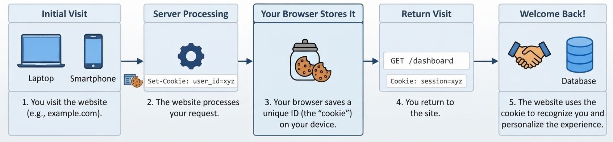
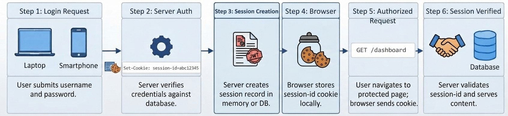
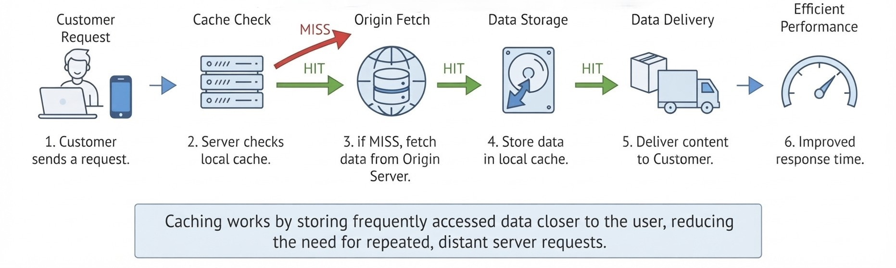

# Week 5: Session State and Data Persistence

Last week we built a REST API for our bookstore and leaned hard on one of REST's constraints: statelessness. Every request had to carry everything the server needed to answer it. That works beautifully for looking up books, but think about the last time you shopped online. You added something to a cart, browsed a few more pages, and the cart was still there. The site remembered you. This week is about how that remembering actually happens, where the data lives, and what each choice costs us.

## HTTP Has No Memory

HTTP treats every request as a fresh conversation. If you send two identical GET requests a second apart, the server has no built-in way to know they came from the same person. Nothing in the protocol links them.

Every "remembering" feature on the web, from logins to carts to "recently viewed" lists, is built on top of HTTP by the application. There are really only three places to put state:

| Location | Examples | Who controls it |
|---|---|---|
| Client | Cookies, URL query strings, browser localStorage | The user, who can read and edit it |
| Server, per user | Sessions | The server |
| Server, shared by everyone | Cache, database, files | The server |

Most real applications use all three, and a big part of web development is knowing which kind of data belongs where.

## Cookies

A cookie is a small piece of text the server asks the browser to keep. The server sends it in a response header:

```
HTTP/1.1 200 OK
Set-Cookie: visits=3; Max-Age=86400; HttpOnly; SameSite=Lax
```

From then on, the browser automatically attaches it to every request to that site:

```
GET /api/visits/ HTTP/1.1
Cookie: visits=3
```

The attributes control the cookie's behavior. `Max-Age` or `Expires` sets its lifetime (without either, it disappears when the browser closes). `Path` and `Domain` limit where it is sent. `Secure` restricts it to HTTPS. `HttpOnly` hides it from JavaScript, which matters a lot for security. `SameSite` controls whether it is sent on requests coming from other sites.



Cookies have two real limits. They are small, around 4 KB each, and they ride along on every single request, so stuffing data into them slows everything down. More importantly, they live on the client, and the client can change them. Anyone can open the browser's developer tools and edit a cookie. That gives us a firm rule: never trust a cookie's value for anything that matters, such as a price, a user's role, or the contents of a cart.

## Sessions

Sessions solve the trust problem by flipping where the data lives. The server keeps the actual data and gives the client only a long random ID in a cookie. On each request, the server reads the ID and looks up the matching data.



If that sounds familiar, it should. It is a hash table: the session ID is the key and the user's data is the value. The client can still edit its cookie, but changing the ID just means pointing at a session that does not exist, which is useless to an attacker unless they steal someone else's valid ID. (Protecting against that theft is part of Week 8.)

### Sessions in Django

Django's `SessionMiddleware`, enabled by default in every new project, does the bookkeeping. Before your view runs, it reads the `sessionid` cookie and loads the matching data. After your view returns, it saves any changes and sends the cookie back if needed. Inside the view, you just use `request.session` like a dictionary.

Where the data is actually stored depends on the session backend:

| Backend | Stored in | Notes |
|---|---|---|
| `db` (default) | A database table | Needs `migrate` to create the table |
| `cache` | The cache | Fast, but data vanishes if the cache is cleared |
| `cached_db` | Cache and database | Reads from cache, writes through to the database |
| `file` | Files on disk | Simple, single machine only |
| `signed_cookies` | The cookie itself | Signed so tampering is detected, but readable by the client |

### What a Session Can Hold

Django serializes session data to JSON before storing it. That has a few consequences worth remembering. Dictionary keys always come back as strings, so if you store `{1: 2}` you will read back `{"1": 2}`. Types JSON does not understand, like `Decimal` or `datetime`, have to be converted (usually to strings) first.

There is also a subtle trap. Django only saves the session if it knows something changed. Assigning a key, like `request.session["cart"] = cart`, is detected. Changing something inside an existing value, like `request.session["cart"]["1"] = 5`, is not, and your change silently disappears. Either reassign the whole value or set `request.session.modified = True`.

### Sessions and REST

Here is the honest part. A session means the server holds data about each client between requests, which bends REST's stateless constraint. Many real APIs accept that tradeoff because it is convenient and keeps sensitive data off the client. The cost shows up when you scale: every server handling requests needs access to the same session store. The common alternative is a signed token the client sends on every request, so the server holds nothing. We come back to tokens alongside security in Week 8.

## Shared Variables

Look at `catalog/data.py` from last week. `BOOKS` is a module-level list, and every request that reaches our app reads and writes the same list. That makes it a shared variable: state visible to all users at once, as opposed to session state, which belongs to one user.

This works with `runserver` because it runs a single process. Production servers usually run several worker processes to handle traffic, and each process loads its own copy of every module. If a POST that adds a book lands on worker 2, workers 1, 3, and 4 never see the new book. Users would get different answers depending on which worker happened to serve them.

The fix is to keep shared state somewhere every worker can reach, such as a cache server or a database. Keep this problem in mind; it is a big part of why next week's database matters.

## Caching

Caching means saving the result of expensive work so you can reuse it instead of redoing it. When a request finds the result already stored, that is a cache hit. When it does not, that is a miss: you do the work, then store the result for next time. Every cached value gets a TTL (time to live), after which it expires.



Caching happens at several layers. Browsers and proxies cache responses based on HTTP headers like `Cache-Control: max-age=60`. CDNs keep copies of responses on servers close to users. On our own server, we can cache an entire view's response, part of a template, or individual values in code.

### Django's Cache Framework

Django gives one API over several storage backends:

| Backend | Shared across workers? | Typical use |
|---|---|---|
| `LocMemCache` | No, one copy per process | Development, demos |
| `FileBasedCache` | Yes, on one machine | Small deployments |
| `DatabaseCache` | Yes | When no separate cache service is available |
| Memcached / Redis | Yes | Production |

Notice that `LocMemCache` has exactly the same problem as our `BOOKS` list. We use it this week because it needs no installation, but Melé's Chapter 14 shows the production setup with a dedicated cache server.

You will use caching in two styles. The `cache_page` decorator caches a view's entire response, keyed by URL, with almost no code. The low-level API (`cache.get`, `cache.set`, `cache.delete`) caches individual values and leaves you in charge of what is stored and when it is cleared.

### Cache Invalidation

The hardest part of caching is not storing things but knowing when stored things are wrong. If the data changes while an old copy sits in the cache, users get stale answers until the TTL runs out. You have two main tools: keep the TTL short and accept brief staleness, or delete the cached value whenever the underlying data is written. Per-view caching makes the second option awkward because you do not control its keys directly. Low-level caching makes it easy. Exercise 2 shows both side by side.

## JSON and XML as Persistence Formats

We have now used both data formats from earlier weeks for storage, not just for messages. Django stores sessions as JSON. Our API speaks JSON. Week 3's XML-RPC calls traveled as XML. The same formats work for saving data to files: Python's `json` module and `xml.etree.ElementTree` turn data structures into text you can write to disk and read back later.

Files are the simplest persistent store, and the at-home activity has you try it. They also show their limits quickly: two requests writing the same file at once can corrupt it, you cannot query a file without loading all of it, and every change means rewriting the whole thing. Those limits are exactly what databases are built to solve.

## Same Pattern, Other Frameworks

Cookies, sessions, and caching are HTTP-level ideas, so every web framework offers the same tools under different names.

| Concept | Django | Spring Boot | Express | ASP.NET Core |
|---|---|---|---|---|
| Session | `request.session` | `HttpSession` | `express-session` middleware | `HttpContext.Session` |
| Set a cookie | `response.set_cookie()` | `ResponseCookie` | `res.cookie()` | `Response.Cookies.Append()` |
| Cache | `cache`, `cache_page` | `@Cacheable` | `node-cache` or a Redis client | `IMemoryCache`, `IDistributedCache` |

If you understand what a session ID cookie does and why a cache needs invalidation, switching frameworks is mostly a matter of looking up names.

## Exercise 1: Cookies and a Session Cart

We continue the `bookstore` project and its `catalog` app. This exercise builds a raw cookie first so you can see its weakness, then a cart stored safely in the session.

### Step 1: Create the session table

The default session backend stores data in the database, so Django needs its session table. From the project folder (the one containing `manage.py`), with your virtual environment active:

```
python manage.py migrate
```

You should see `sessions` among the applied migrations. Confirm that `settings.py` still has both of these (they are there by default):

```python
INSTALLED_APPS = [
    # ...
    "django.contrib.sessions",
    # ...
]

MIDDLEWARE = [
    # ...
    "django.contrib.sessions.middleware.SessionMiddleware",
    # ...
]
```

### Step 2: A visit counter using a raw cookie

Create `catalog/state_views.py`:

```python
import json

from django.http import HttpResponse, JsonResponse
from django.views.decorators.csrf import csrf_exempt
from django.views.decorators.http import require_GET, require_http_methods

from .data import find_book


@require_GET
def visit_counter(request):
    try:
        visits = int(request.COOKIES.get("visits", 0)) + 1
    except ValueError:
        visits = 1
    response = JsonResponse({"visits": visits})
    response.set_cookie(
        "visits", str(visits),
        max_age=60 * 60 * 24, httponly=True, samesite="Lax",
    )
    return response
```

`request.COOKIES` is a dictionary of whatever cookies the client sent. Cookie values are always strings, so we convert to `int` and fall back to 1 if someone sent garbage. `set_cookie` adds the `Set-Cookie` header to the response, with a one day lifetime.

### Step 3: A cart stored in the session

Add the cart to the same file, below the visit counter:

```python
CART_KEY = "cart"


def cart_payload(cart):
    items, total = [], 0.0
    for book_id, quantity in cart.items():
        book = find_book(int(book_id))
        if book is None:
            continue
        line_total = book["price"] * quantity
        total += line_total
        items.append({
            "book_id": book["id"],
            "title": book["title"],
            "quantity": quantity,
            "line_total": round(line_total, 2),
        })
    return {"items": items, "total": round(total, 2)}


@csrf_exempt
@require_http_methods(["GET", "POST", "DELETE"])
def cart_view(request):
    cart = request.session.get(CART_KEY, {})

    if request.method == "POST":
        try:
            data = json.loads(request.body)
            book_id = int(data["book_id"])
            quantity = int(data.get("quantity", 1))
        except (ValueError, KeyError, TypeError):
            return JsonResponse({"error": "book_id and an integer quantity are required"}, status=400)
        if find_book(book_id) is None:
            return JsonResponse({"error": "Book not found"}, status=404)

        key = str(book_id)
        cart[key] = cart.get(key, 0) + quantity
        request.session[CART_KEY] = cart

    elif request.method == "DELETE":
        request.session.pop(CART_KEY, None)
        return HttpResponse(status=204)

    return JsonResponse(cart_payload(cart))
```

A few choices here are deliberate. The cart stores only book IDs and quantities, never prices. Prices are looked up fresh from the catalog every time, so nothing the client holds can change what they pay. The keys are strings (`str(book_id)`) because the session is stored as JSON and integer keys would come back as strings anyway; being explicit avoids a confusing mismatch. The line `request.session[CART_KEY] = cart` is what tells Django the session changed. And GET uses `request.session.get` rather than creating an empty cart, so simply looking at an empty cart does not create a session.

As in Week 4's hand-built views, `csrf_exempt` lets our script POST without a CSRF token. Be aware this is a real risk once a session cookie is involved, because a malicious site could make a logged-in browser send requests here. We are accepting it for the demo; Week 8 covers the proper defense.

### Step 4: Wire up the URLs

Open `catalog/rest_urls.py`. Keep your existing Week 4 routes and add these two to `urlpatterns`, plus the import:

```python
from . import state_views

urlpatterns = [
    # ... existing Week 4 routes stay here ...
    path("visits/", state_views.visit_counter, name="visit-counter"),
    path("cart/", state_views.cart_view, name="cart"),
]
```

Since `bookstore/urls.py` already includes this file under `api/`, the new endpoints are `/api/visits/` and `/api/cart/`. Start the server:

```
python manage.py runserver
```

### Step 5: See the difference a cookie jar makes

Create `state_client.py` next to `manage.py`:

```python
import requests

BASE = "http://127.0.0.1:8000/api"

print("Plain requests, no cookie jar:")
for _ in range(3):
    print("  ", requests.get(f"{BASE}/visits/").json())

print("requests.Session, cookies kept like a browser:")
browser = requests.Session()
for _ in range(3):
    print("  ", browser.get(f"{BASE}/visits/").json())

print("Forged cookie:")
r = requests.get(f"{BASE}/visits/", cookies={"visits": "9999"})
print("  ", r.json())
```

Run it with `python state_client.py`. Plain `requests.get` forgets cookies between calls, so the count stays at 1, exactly like HTTP with no memory. `requests.Session` keeps a cookie jar, so the count climbs. The last call is the important one: the server happily reports 10000 visits because the client simply claimed 9999. Imagine that cookie held a price.

### Step 6: Use the cart

Add this to the bottom of `state_client.py` and run it again:

```python
print("Cart with a session:")
shopper = requests.Session()
shopper.post(f"{BASE}/cart/", json={"book_id": 1, "quantity": 2})
r = shopper.post(f"{BASE}/cart/", json={"book_id": 2})
print("  ", r.json())
print("   Cookies held by client:", shopper.cookies.get_dict())

print("A different client:")
print("  ", requests.get(f"{BASE}/cart/").json())
```

The shopper's cookie jar now holds only `sessionid`, a random string with no cart data in it. A second client gets an empty cart, because it has no session ID. There is nothing useful for the client to forge.

### Step 7: Look inside the session store

Open the Django shell:

```
python manage.py shell
```

```python
from django.contrib.sessions.models import Session
s = Session.objects.latest("expire_date")
s.session_data[:60]
s.get_decoded()
```

`get_decoded()` returns `{'cart': {'1': 2, '2': 1}}`, the plain dictionary with string keys. `session_data` holds the same dictionary as base64-encoded JSON followed by a timestamp and a signature, so it is signed but not encrypted. Running `s.session_key` shows the same value the client printed as its `sessionid`. The cart lives on the server, tied to that one ID.

If your shell shows `{}` instead, your client deleted the cart before you looked. Remove any `shopper.delete` lines from `state_client.py`, run it again, and repeat this step.

### Step 8: Clear the cart

Add these lines to the bottom of `state_client.py`, run it, then repeat Step 7:

```python
shopper.delete(f"{BASE}/cart/")
print("After DELETE:", shopper.get(f"{BASE}/cart/").json())
```

The DELETE returns 204 and the next GET shows an empty cart. In the shell, `get_decoded()` now returns `{}`: the session row and its ID still exist, but the cart key is gone.

### Step 9: Break it on purpose

In `cart_view`, comment out `request.session[CART_KEY] = cart`, save, and run the client again. Each POST response still lists the item from that one request, because `cart_payload` reads the local dictionary. But the second POST shows only book 2, the shopper's cookie jar is empty, and the final GET returns an empty cart. Changing a local dictionary never told Django the session changed, so nothing was saved and no session cookie was ever issued. Restore the line before moving on.

## Exercise 2: Caching a Slow Endpoint

Now we look at shared, server-side state. We will build an endpoint that is slow on purpose, cache it two different ways, and see how each one copes when the data changes.

### Step 1: Configure the cache

Add this to `bookstore/settings.py`. Django uses an in-memory cache by default, but writing it out makes the choice visible:

```python
CACHES = {
    "default": {
        "BACKEND": "django.core.cache.backends.locmem.LocMemCache",
        "LOCATION": "bookstore-cache",
        "TIMEOUT": 300,
    }
}
```

`TIMEOUT` is the default TTL in seconds. `LOCATION` just names this memory store.

### Step 2: Build a slow statistics endpoint

Create `catalog/cache_views.py`:

```python
import time

from django.core.cache import cache
from django.http import JsonResponse
from django.views.decorators.cache import cache_page
from django.views.decorators.http import require_GET

from .data import BOOKS

STATS_KEY = "catalog:stats"


def compute_stats():
    time.sleep(2)  # stands in for a slow query or a call to another service
    prices = [book["price"] for book in BOOKS]
    return {
        "count": len(BOOKS),
        "average_price": round(sum(prices) / len(prices), 2) if prices else 0,
        "in_stock": sum(1 for book in BOOKS if book["in_stock"]),
    }


def invalidate_stats():
    cache.delete(STATS_KEY)


@require_GET
def stats_uncached(request):
    return JsonResponse(compute_stats())


@require_GET
@cache_page(60)
def stats_page_cached(request):
    return JsonResponse(compute_stats())


@require_GET
def stats_low_level(request):
    data = cache.get(STATS_KEY)
    hit = data is not None
    if not hit:
        data = compute_stats()
        cache.set(STATS_KEY, data, timeout=300)
    response = JsonResponse(data)
    response["X-Cache"] = "HIT" if hit else "MISS"
    return response
```

`time.sleep(2)` makes the cost of computing obvious. `stats_page_cached` uses `cache_page(60)`, which stores the full response for 60 seconds, keyed by the URL. `stats_low_level` checks the cache itself, computes only on a miss, and adds a custom `X-Cache` header so we can see which path it took. `invalidate_stats` deletes the cached value; we will call it whenever the catalog changes.

### Step 3: Invalidate when a book is added

Open `catalog/rest_views.py` from Week 4. Add the import at the top:

```python
from .cache_views import invalidate_stats
```

Then, inside the POST branch of `book_list`, right after the line that appends the new book to `BOOKS`, add:

```python
        invalidate_stats()
```

Writing data and clearing the cached copy of it now happen together.

### Step 4: Wire up the URLs

In `catalog/rest_urls.py`, add the import and three routes alongside the existing ones:

```python
from . import cache_views

urlpatterns = [
    # ... existing routes stay here ...
    path("stats/slow/", cache_views.stats_uncached, name="stats-slow"),
    path("stats/page/", cache_views.stats_page_cached, name="stats-page"),
    path("stats/", cache_views.stats_low_level, name="stats"),
]
```

Restart the server so the new settings load.

### Step 5: Measure the difference

Create `cache_client.py` next to `manage.py`. The POST body uses the same fields as Week 4's book list endpoint; adjust them if yours differ.

```python
import time

import requests

BASE = "http://127.0.0.1:8000/api"


def timed_get(path):
    start = time.perf_counter()
    r = requests.get(f"{BASE}{path}")
    ms = (time.perf_counter() - start) * 1000
    print(f"{path:<14} {ms:7.0f} ms  {r.headers.get('X-Cache', '-'):>4}  {r.json()}")


print("Uncached:")
timed_get("/stats/slow/")
timed_get("/stats/slow/")

print("Per-view cache:")
timed_get("/stats/page/")
timed_get("/stats/page/")

print("Low-level cache:")
timed_get("/stats/")
timed_get("/stats/")

print("Adding a book...")
requests.post(f"{BASE}/books/", json={
    "title": "Cache Me If You Can",
    "author": "A. Tester",
    "price": 19.99,
    "in_stock": True,
})

print("After the write:")
timed_get("/stats/page/")
timed_get("/stats/")
```

Run `python cache_client.py`. The uncached endpoint takes about two seconds every time. Both cached versions take two seconds once and then answer almost instantly.

### Step 6: Read the stale result

Look at the two lines after the write. The per-view cache still reports the old count: it has no idea the catalog changed, and it will keep serving that answer until its 60 seconds run out. The low-level endpoint shows a MISS, takes two seconds, and reports the new count, because the POST deleted its key. Both versions are fast; only one of them is correct. That is the invalidation problem in one screen.

Also note what kind of state this is. Unlike the cart, the cached statistics are shared by every user. And because `LocMemCache` lives inside one process, it would have the same multi-worker problem as `BOOKS` in production.

## At-Home Bonus Activity (Ungraded)

Extend Exercise 2 so the catalog survives a server restart, and export it as XML.

1. In `catalog/data.py`, load `BOOKS` from `catalog/books.json` when the module is imported, falling back to the current hardcoded list if the file does not exist. Write a `save_books()` helper that writes `BOOKS` to that file with `json.dump`, and call it in the POST branch of `book_list` next to `invalidate_stats()`. Add a book, stop the server, start it again, and confirm the book is still there.
2. Your Week 4 DRF view (`BookListAPI` at `/api/v2/books/`) also adds books. Make it save and invalidate too, then explain why having two write paths makes this easy to forget.
3. Add a GET endpoint at `/api/books.xml` that builds a `<catalog>` document with one `<book>` element per book using `xml.etree.ElementTree`, and returns it with content type `application/xml`. Compare its size with the JSON list for the same data.
4. Discussion: imagine the app running with four worker processes. For each of these, decide whether all workers would see the same data and why: the session cart (database backend), the `LocMemCache` statistics, the `BOOKS` list, and `books.json`. What could still go wrong with the file even if every worker reads it?

## References

Django Software Foundation. (n.d.). Django's cache framework. Django documentation. https://docs.djangoproject.com/en/5.0/topics/cache/

Django Software Foundation. (n.d.). How to use sessions. Django documentation. https://docs.djangoproject.com/en/5.0/topics/http/sessions/

Melé, A. (2024). Django 5 by example (5th ed., Chapters 8 and 14). Packt Publishing.
